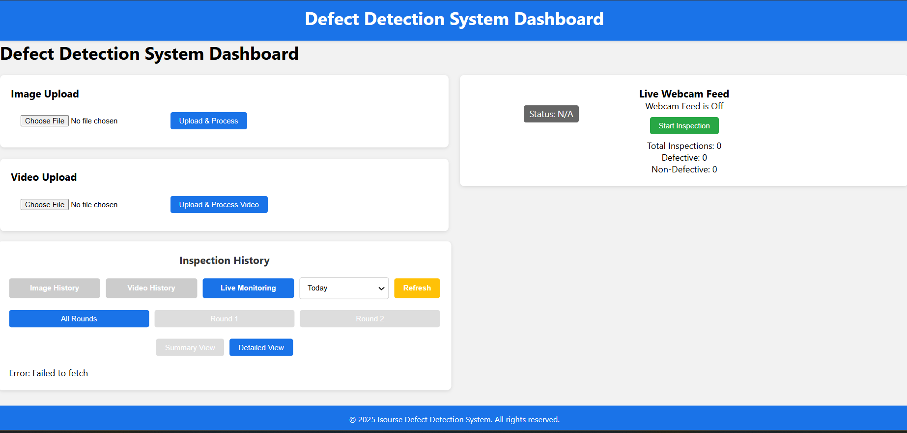

# 🚀 FlowVision - AI-Powered Casting Defect Detection System

[](https://www.python.org/)
[](https://flask.palletsprojects.com/)
[](https://reactjs.org/)
[](https://www.tensorflow.org/)
[](LICENSE)

## 🎯 Overview
**FlowVision** is a production-ready, full-stack AI system for **real-time defect detection in manufacturing castings**. Trained a custom CNN on 7k+ images achieving **93% accuracy**, it automates quality inspection – **9-18x faster** than manual (1000 items: 3hrs → 16-32mins).



### Key Features
| Feature | Description |
|---------|-------------|
| 🖼️ **Image Upload** | Drag-drop images, instant prediction + bounding box, CSV export |
| 🎥 **Video Analysis** | Frame extraction (every 30th), annotated output video, metadata CSV |
| 📹 **Live Webcam** | Real-time MJPEG stream with green/red boxes, live CSV logging |
| 📊 **Dashboard** | Defect trends (bar/pie charts), history filters (today/7d/30d), recent 5 inspections |
| 💾 **Audit Trail** | Auto-save processed media + structured CSVs for compliance |

**Watch Demos**:
- [Current UI Demo](current%20basic%20ui%20demo.mp4)
- [Final UI Vision](will%20be%20final%20UI.mp4)

## 🏗️ Architecture
```
Frontend (React + AntD + Chart.js + Axios)
           ↓ REST APIs
Backend (Flask + OpenCV + TensorFlow/Keras)
           ↓ CNN Model (150x150 input)
defect_detector_model.h5 (93% acc)
           ↓ Storage
uploads/ | video_processing/ | live_monitoring/ + CSVs
```

## 🚀 Quick Start (5 mins)
### Backend (Terminal 1)
```bash
cd backend
python -m venv venv
venv\Scripts\activate  # Windows
pip install -r requirements.txt
copy .env.example .env  # Edit MODEL_PATH if needed
python app.py  # http://localhost:5000
```

### Frontend (Terminal 2)
```bash
cd frontend
npm install
npm start  # http://localhost:3000
```

**Test Flow**:
1. Upload image → See prediction + box.
2. Video upload → Annotated MP4 + table.
3. Webcam → Live stream + charts.
4. Download CSV → Inspect history.

## 🛠️ Tech Stack
- **ML**: Custom CNN (Keras/TF), OpenCV (frames/streaming)
- **Backend**: Flask, Pandas (CSV), Pillow (images)
- **Frontend**: React 18, Ant Design, Chart.js, Axios
- **Dev**: Venv, npm, .env config, CORS secure

## 📈 Performance & Impact
- **Speed**: Live inspect @1-2s/item (conveyor-ready).
- **Accuracy**: 93% on diverse warehouse dataset.
- **Scalable**: Threaded processing, future Docker/WebSocket.

## 🤝 Contributing
Fork, PR improvements (e.g., YOLOv8, S3 storage, auth).

## 📝 Author
**SuMit SinGh** - Full-stack ML Engineer  
[email protected]  # Update yours

## 📄 License
MIT - Free for commercial/resume use.

**Deployed?** Render/Heroku easy. Star if useful! ⭐

